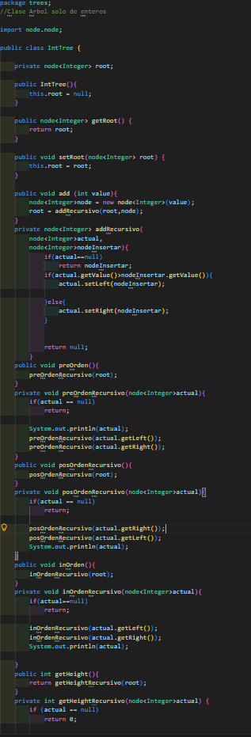
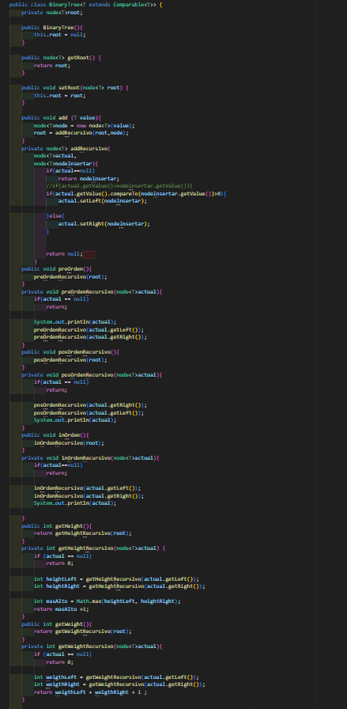

## Practica Recursividad y Arbol 

**Nombre**: Sebastian Cabrera Lima.
**Fecha**: 22 de junio del 2026.

## Clase 1 
Implementacion de Recursividad y Arboles:
Este código implementa un árbol binario de búsqueda para almacenar números enteros, donde cada nodo organiza los valores menores a la izquierda y mayores a la derecha. Permite insertar datos, recorrer el árbol y calcular su altura y cantidad de nodos.

## Clase 2 
Implementacion de recursividad y arboles:
En este ejercicio se implementó un árbol binario de búsqueda usando una clase genérica BinaryTree.java. Mediante el método add(), se crean nuevos nodos y con addRecursivo() se compara cada valor para ubicarlo correctamente: los valores menores van a la izquierda y los mayores a la derecha. Se utilizó Comparable para poder comparar diferentes tipos de datos y mantener el árbol organizado.

